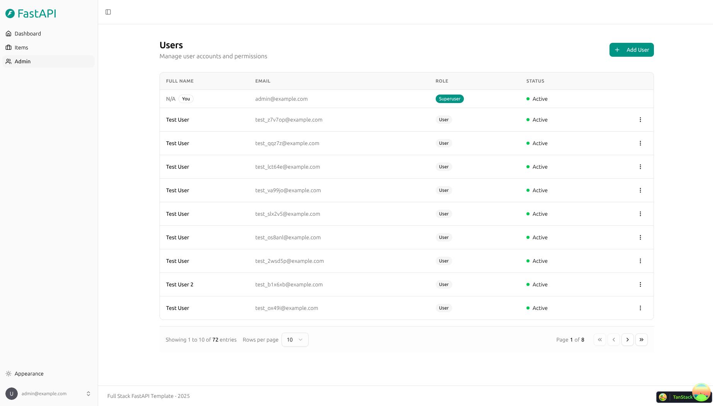
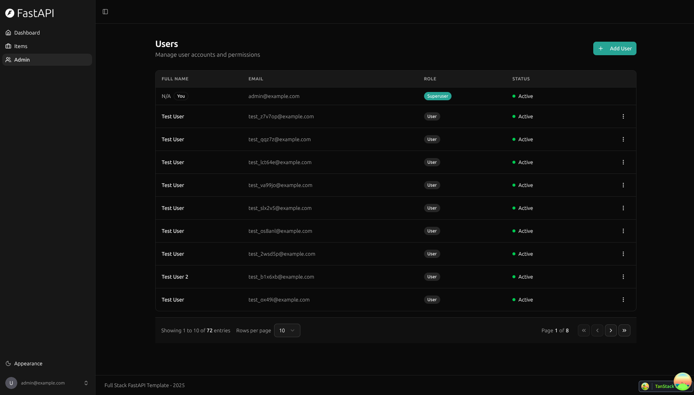
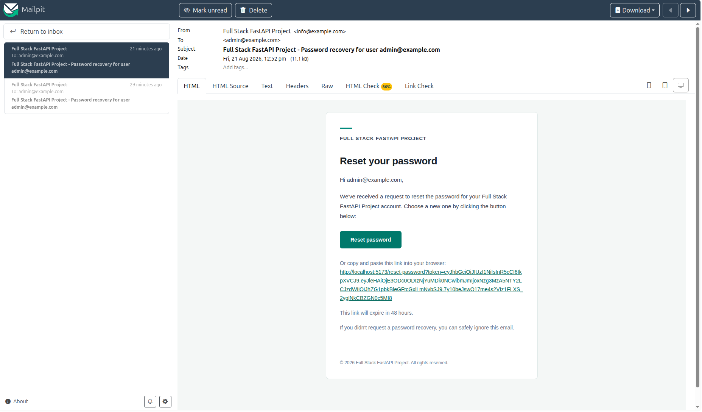

# Nightingale

[](../../actions/workflows/test-docker-compose.yml)
[](../../actions/workflows/test-backend.yml)

## Technology Stack and Features

- ⚡ [**FastAPI**](https://fastapi.tiangolo.com) for the Python backend API.
  - 🧰 [SQLModel](https://sqlmodel.tiangolo.com) for the Python SQL database interactions (ORM).
  - 🔍 [Pydantic](https://docs.pydantic.dev), used by FastAPI, for the data validation and settings management.
  - 💾 [PostgreSQL](https://www.postgresql.org) as the SQL database.
- 🚀 [React](https://react.dev) for the frontend.
  - 🧩 Built into the backend application and served by FastAPI on the same domain as the API.
  - 💃 Using TypeScript, hooks, [Vite](https://vitejs.dev), and other parts of a modern frontend stack.
  - 🎨 [Tailwind CSS](https://tailwindcss.com) and [shadcn/ui](https://ui.shadcn.com) for the frontend components.
  - 🤖 An automatically generated frontend client.
  - 🧪 [Playwright](https://playwright.dev) for end-to-end testing.
  - 🦇 Dark mode support.
- ☁️ [FastAPI Cloud](https://fastapicloud.com) for deployment.
- 🐋 [Docker Compose](https://www.docker.com) for local services and self-hosted deployment.
  - 📞 [Traefik](https://traefik.io) as a reverse proxy with automatic HTTPS.
- 🔒 Secure password hashing by default.
- 🔑 JWT (JSON Web Token) authentication.
- 📫 Email-based password recovery.
- ✉️ [React Email](https://react.email) for email templates.
- 📬 [Mailpit](https://mailpit.axllent.org) for local email testing during development.
- ✅ Tests with [Pytest](https://pytest.org).
- 🏭 CI (continuous integration) and CD (continuous deployment) based on GitHub Actions.

### Dashboard Login


### Dashboard - Admin



### Dashboard - Items


### Dashboard - Dark Mode



### React Email Templates


### Mailpit - Local Email Testing



### Interactive API Documentation


## How to Use It

Nightingale retains the template infrastructure while replacing its example
Item domain with clinic-scoped patients, entries, collaboration, trust, and
audit capabilities.

## AI trust, importance, and retention

The backend now exposes clinic-scoped AI ingestion and reanalysis, persistent
jobs/attempts, fail-closed redaction, immutable AI output entries, evidence
spans, bounded importance feedback, and encrypted cold archive/rehydration:

```text
POST /api/v1/patients/{patient_id}/ai/ingest     (Idempotency-Key required)
POST /api/v1/patients/{patient_id}/ai/reanalyze  (Idempotency-Key required)
GET  /api/v1/jobs/{job_id}
POST /api/v1/jobs/{job_id}/retry
GET  /api/v1/decay/preview
POST /api/v1/decay/archive
POST /api/v1/decay/entries/{version_id}/rehydrate
```

`AI_PROVIDER=deterministic` is the default offline fixture. OpenAI text egress
requires all of `AI_PROVIDER=openai`, `REMOTE_TEXT_EGRESS_ENABLED=true`,
`OPENAI_API_KEY`, and `OPENAI_EXTRACT_MODEL`. Model IDs are read only from the
environment. Configured remote jobs are queued for a leased worker rather than
executed in the submitting HTTP request; the offline deterministic fixture may
complete synchronously for the demo. Docker Compose runs that consumer as the
`ai-worker` service (`python -m app.ai_worker`); every completion is fenced by a
unique attempt token, an unexpired lease, and a live Worker membership. Before
any remote call, Nightingale
performs NFC normalization, server-decrypted patient-name and Singapore
identifier/contact redaction, embedded Presidio analysis, and a residual scan.
Missing Presidio NLP models, analyzer errors, or residual findings block remote
egress and produce explicit `fallback/needs_review` state. Application code
never downloads a language model. The default image intentionally omits the
model; a remote-egress Docker build must set `INSTALL_PRESIDIO_NLP=true` and
leave `PRESIDIO_NLP_MODEL=en_core_web_sm`. Startup fails closed if the locked
model cannot be loaded.

Client-supplied name dictionaries and risk flags are not part of the ingest
contract. Risk is derived from server conflict/highlight state, deterministic
critical-text rules, and extracted critical facts. A high-risk run first uses
`OPENAI_EXTRACT_MODEL`, then independently calls `OPENAI_REVIEW_MODEL`; both
outputs are encrypted and the persisted run records whether they were
consistent, disagreed, unavailable, or errored. System-derived versions and
completion events are authored by the clinic/job-bound Worker, while the Job
retains the staff/clinician requester.

The API database login is `nightingale_app`, a non-owner
`NOSUPERUSER NOBYPASSRLS` role. The one-shot prestart/Alembic path alone receives
the owner URL. Tenant RLS context is transaction-local and is restored from the
already-verified server membership after a request-side commit.
Long-running production API and worker processes verify the effective database
role at startup and health/worker boundaries. They terminate rather than run as
an owner, superuser, `BYPASSRLS` role, or owner of an RLS table.
Production Compose does not include Adminer or expose a database UI. The
optional local-only Adminer profile binds to `127.0.0.1` with Traefik disabled.

Production does not seed a demo clinic or synthetic personas. After migrations,
an operator explicitly provisions the first clinic, Admin membership, and
server-owned Worker membership with the idempotent owner-only command documented
in the deployment guides. The admin password is environment-only and is never
accepted as a process argument. Development Compose remains one-command and
seeds synthetic fixtures only because `compose.override.yml` explicitly sets
`FASTAPI_ENV=development` and `ENABLE_DEMO_AUTH=true`.

Encrypted clinical fields use a dedicated persisted
`FIELD_ENCRYPTION_MASTER_KEY`, independent of the JWT `SECRET_KEY`. Production
requires both. Back up the field key separately: changing or losing it makes
existing ciphertext unreadable; JWT rotation alone does not affect encrypted
fields.

Importance features are bounded taxonomy keys rather than free text. Weights
are clinic-scoped, use diminishing updates, and clamp to `[-0.20, 0.20]`.
Patient Glance responses omit internal score components. Cold decay is limited
to unprotected content older than 730 days; canonical plaintext is hashed,
zstd-compressed, AES-256-GCM encrypted, reread and verified before active
ciphertext is cleared. Versions, audit events, and provenance pointers remain.

Optional dependency groups are not installed by the default demo:

```bash
uv sync --project backend --group local-asr
uv sync --project backend --group diarization
uv sync --project backend --group presidio-nlp
```

`local-asr` and `diarization` do not download or validate model weights
automatically. `presidio-nlp` installs the locked `en_core_web_sm` package for
the fail-closed remote-text boundary; it is omitted by the default demo.

## Voice capture and clinical Review Mode

Nightingale now includes encrypted, resumable MediaRecorder capture, per-device
idempotent chunks, persistent FFmpeg preprocessing, explicit transcription
provider gates, immutable transcript corrections, evidence-bound clinical
facts, and clinician-only publication. The default no-key configuration keeps
ordinary audio and reports `needs_review`; it does not synthesize a transcript.
The deterministic code-switch/overlap transcript is available only for an
explicit local synthetic fixture session.

Clinical routes provide mobile capture and a transcript/summary/facts Review
Mode. Patient routes expose only patient-safe recording status and a summary
after clinician publication. Raw transcript and facts are not part of the
Patient DTO.

See [Voice pipeline and operating boundary](./docs/VOICE_PIPELINE.md) for the
state machine, API, offline recovery behavior, FFmpeg build record, OpenAI audio
gates, and optional cached-model overlays.

## Backend Development

Backend docs: [backend/README.md](./backend/README.md).

## Frontend Development

Frontend docs: [frontend/README.md](./frontend/README.md).

## Deployment

FastAPI Cloud deployment: [deployment.md](./deployment.md).

Self-hosted deployment with Docker Compose: [deployment-docker-compose.md](./deployment-docker-compose.md).

## Development

General development docs: [development.md](./development.md).

This includes the local FastAPI and Vite workflow, Docker Compose services, `.env` configuration, and more.

## Release Notes

Check the file [release-notes.md](./release-notes.md).

## License

Nightingale is licensed under the MIT License. See [ATTRIBUTION.txt](./ATTRIBUTION.txt) and [THIRD_PARTY_NOTICES.md](./THIRD_PARTY_NOTICES.md) for baseline and planned-component notices.
