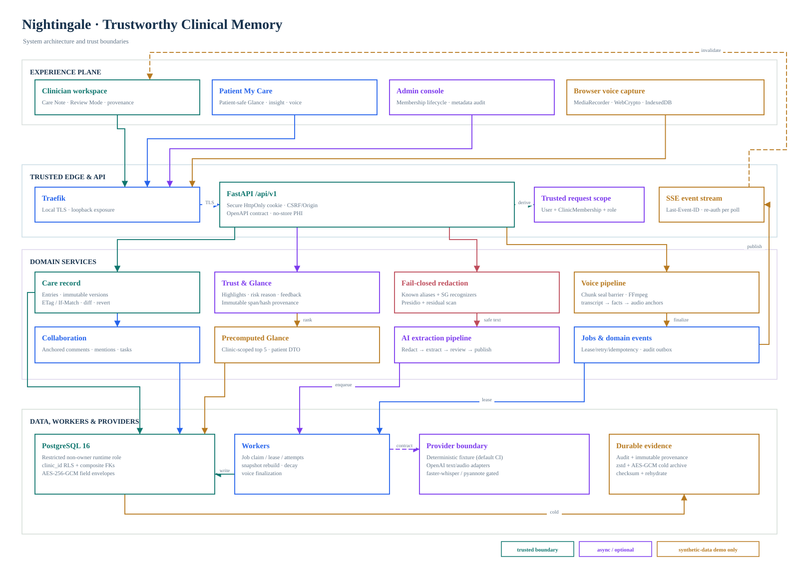
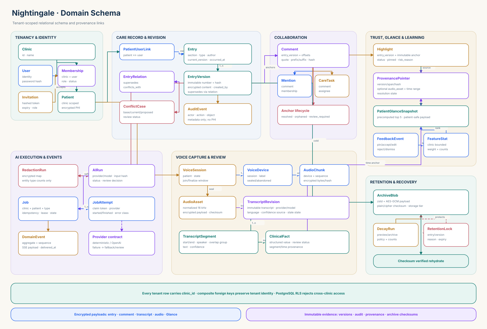

# Nightingale — historical delivery technical brief

This document preserves delivery-specific evidence and claim boundaries for the recorded build. For the current product and architecture overview, read [`docs/ARCHITECTURE.md`](../ARCHITECTURE.md); for the current submission brief, read [`docs/TECHNICAL_BRIEF.md`](../TECHNICAL_BRIEF.md).

**72-hour synthetic healthcare collaboration candidate · synthetic data only · 26 August 2026**

Nightingale is a clinic-scoped care-note workspace designed to answer one practical question quickly: **what matters for this patient now, and what immutable source supports it?** It combines a precomputed Glance view, versioned human notes, anchored collaboration, reviewable AI-derived material, and recoverable voice capture without making an external model a prerequisite for the core demo. Every identity and clinical record in the repository is synthetic.

## 1 · Problem and solution

Electronic records accumulate long notes, comments, generated summaries, and audio. A concise top card is useful only when users can inspect its source, understand why it ranked, distinguish human from derived content, and rely on permissions at both application and database boundaries. Nightingale therefore treats **evidence, version, tenant, role, and review state** as first-class data rather than UI labels.

The implemented product loop is:

1. A Staff or Clinician user opens **Alex Synthetic** and reads at most five precomputed Glance cards.
2. Each card exposes a reason and resolves to an exact span in an immutable `EntryVersion`.
3. Staff and Clinician sections are independent entries; edits use `ETag`/`If-Match`, stale writes return `409 VERSION_CONFLICT`, and revert creates another version.
4. Selected-text comments retain offsets, quote, prefix/suffix, and SHA-256 context; threads support replies, mentions, assignment, resolution, and orphan/review state.
5. AI and voice outputs remain derived, reviewable records. A Clinician publishes accepted voice facts as new immutable entries; no generated result overwrites a human note.
6. Patient responses are separate DTOs that omit raw AI, internal comments, scores, facts, transcripts, warnings, and audio.

## 2 · Architecture



The browser application uses React, Vite, TanStack Router/Query, shadcn/ui, Tiptap `3.30.3`, the Serene comment mark extension `0.2.0`, MediaRecorder, WebCrypto, and IndexedDB. Traefik terminates local TLS. FastAPI serves the `/api/v1` boundary and the production frontend from the same origin. SQLModel and Alembic target PostgreSQL 16; a separate durable worker claims AI and voice jobs. The codebase is pinned to Python 3.12.

The default checkout is deliberately deterministic and offline: `AI_PROVIDER=deterministic`, voice transcription is disabled for ordinary recordings, and remote text/audio egress flags are false. Optional OpenAI, faster-whisper, and pyannote paths sit behind explicit configuration gates; no model weights or Hugging Face token are bundled.

### Implemented capability surface

| Area | Implemented behavior |
| --- | --- |
| Identity and tenancy | Secure-cookie login; Patient, Staff, Clinician, Admin, and Worker memberships; clinic-scoped read-only Admin oversight; one-time admin invitations; patient-record links; clinic-scoped RLS |
| Care Note | Timeline; separate Staff/Clinician entries; Tiptap editor; immutable versions, diff, revert, CAS conflict; metadata-only audit |
| Trust | Glance top five; score components and risk reason; accept/reject/pin; exact-span provenance; bounded clinic-scoped learning |
| AI | Fail-closed redaction; deterministic and configured remote-provider contracts; jobs, attempts, retry, idempotency, SSE status, fallback/review states |
| Data decay | Eligibility preview; dry-run default; zstd + AES-GCM archive; checksum validation; rehydrate while retaining version/audit/provenance rows |
| Voice | Encrypted resumable chunks; multi-device seal barrier; bounded FFmpeg preprocessing; immutable transcript revisions; Review Mode; fact → transcript → audio provenance; Clinician publication |
| Provisional live captions | Same-origin, membership-revalidated WebSocket; bounded 24 kHz PCM16 frames; clinic/user/session leases; deterministic synthetic fixture and gated OpenAI adapter; final transcript remains authoritative |

<div style="page-break-after: always;"></div>

## 3 · Trust, privacy, and data flow

### Trust-preserving write path

```text
human text / synthetic fixture / authorized audio
    → authenticated clinic membership + role check
    → immutable source version or encrypted audio asset
    → deterministic SG recognizers + configured Presidio + residual scan
    → clinic-scoped durable job and fenced worker attempt
    → deterministic fallback or explicitly enabled provider
    → derived entry / highlight / transcript revision / clinical fact
    → immutable span + quote hash (+ audio milliseconds for voice)
    → Clinician review and separate publication
    → precomputed, bounded Glance snapshot
```

Remote text is eligible for egress only after known patient names, NRIC/FIN-like identifiers, MRN, Singapore phone numbers, email patterns, configured Presidio analysis, and a residual scan all pass. The redaction map is encrypted; logs contain entity categories and counts rather than detected values. Missing NLP models, analyzer errors, or residual findings fail closed to a deterministic fallback and `needs_review`. This is a defense layer, not a guarantee that arbitrary real-world clinical text is de-identified.

Voice chunks are encrypted in the browser before IndexedDB persistence and re-encrypted server-side after authenticated upload. Device-specific final indices form a server barrier that rejects missing chunks before finalization. FFmpeg uses argument arrays, protocol restrictions, time and size bounds, `0600` files in a `0700` temporary directory, and produces 16 kHz mono PCM plus silence/clipping/noise review signals. A synthetic transcript fixture exercises speaker, timestamp, language, confidence, code-switching, and overlap states; it is not represented as speech recognition.

### Data model



All tenant rows carry `clinic_id`; tenant-composite foreign keys prevent cross-clinic relationships. The central chain is `Patient → Entry → EntryVersion`. Comments and highlights bind to immutable versions. `ProvenancePointer` stores offsets, exact quote/context, quote hash, and optional audio asset/time range. Glance reads an encrypted `PatientGlanceSnapshot`, not a synchronous model call. AI, redaction, job, attempt, event, importance, decay, archive, voice, transcript, and fact records remain independently auditable.

### Security boundaries

- The server ignores client-supplied clinic, actor, and role authority and resolves a current `ClinicMembership` before protected work. A non-owner runtime database role is `NOSUPERUSER` and `NOBYPASSRLS`; owner credentials are reserved for provisioning and migration.
- Clinical text, comments, Glance payloads, redaction maps, transcript/facts, and audio use AES-256-GCM. HKDF derives a distinct clinic key and authenticated data binds clinic, namespace, and record. The field-encryption key is separate from the session secret outside development.
- Browser auth uses a `Secure`, `HttpOnly`, `SameSite=Lax` cookie. Cookie mutations check Origin; bearer JWT remains only for API compatibility. SSE reauthorizes on each short poll and terminates at token expiry.
- All API responses and the HTML shell are `private, no-store`; only content-hashed assets are public/immutable. Cross-tab logout and rejected session probes mask PHI and complete bounded IndexedDB cleanup before sign-in returns.
- Admin has clinic-scoped read-only oversight of patient records, internal comments, versions, Glance, and provenance, but cannot mutate clinical content or workflow state. Admin also manages memberships and metadata audit. Patient onboarding is not conflated with a care-team invitation. Removal cannot deactivate the last active Admin.
- Local demo ports bind to loopback. Production Compose disables demo auth and fixture seeding, separates owner/runtime database credentials, and promotes the same verified OCI image rather than rebuilding after approval.

<div style="page-break-after: always;"></div>

## 4 · Verification and release evidence

The complete gate is `./scripts/verify-release.sh --e2e --benchmark --ffmpeg`. It checks frozen locks, Ruff/format/mypy/ty, pytest and coverage, Alembic downgrade/upgrade/current/check, frontend type/lint/unit/build, generated OpenAPI client sync, Compose rendering, TLS browser flows, Glance latency, container FFmpeg inventory, and the exact verified image in a separate production topology.

| Checked-in historical evidence at candidate `2e59a9b` | Result | Boundary |
| --- | --- | --- |
| Backend | **180 passed, 1 skipped; 91% coverage** | Local full release-gate run |
| Frontend unit | **26 / 26 passed** | Vitest |
| Browser | **22 tests × 3 = 66 / 66 passed** | Chromium, real HTTPS app; includes Scenarios A–F |
| Glance | **4 / 4 expected cards**; median **3.667 ms**, p95 **4.077 ms**, p99 **4.275 ms** | Alex Synthetic; 20 warmups + 100 local HTTPS samples; p95 gate ≤300 ms |
| Container media | **FFmpeg 7.1.5-0+deb13u1** | Exact Debian arm64 backend image; GPL-enabled build recorded |
| Release artifact | Image `sha256:96252cf9d76d89c69884ce0a9c7849d5be28190dd4b82b2603f077b07fba8c6b` | Benchmark, API, worker, FFmpeg, and production-topology smoke use the same OCI image |

The repository retains a historical machine-readable evidence set for auditability: [`glance-benchmark.json`](../evidence/glance-benchmark.json) records the fixture, response hashes, latency distribution, Compose fingerprint, image digest, and image revision; [`ffmpeg-container-version.txt`](../evidence/ffmpeg-container-version.txt) records the exact container binary and build configuration; and [`release-candidate.txt`](../evidence/release-candidate.txt) is its concise gate summary. It does not attest to later commits. Each delivery bundle contains a newly generated evidence directory—including the raw release log—bound to that bundle's exact source SHA and OCI image. The latency number measures the precomputed snapshot read path, not model inference.

## 5 · Demonstration path

Run `./scripts/demo-up.sh`, accept the local certificate warning at `https://localhost`, and follow `docs/delivery/DEMO_RUNBOOK.md`:

- **A — Evidence:** Glance card → exact immutable Timeline span.
- **B — Collaboration:** anchored comment, `@clinician`, assignment, resolve, diff, revert-as-new-version, learning signal, and metadata-only audit.
- **C — Retention:** cross-date Timeline → eligibility preview → archive → checksum-verified rehydrate.
- **D — Concurrency:** two browser contexts produce a deterministic `409`, while edits to different entries succeed; Admin can read within the clinic but receives `403` on writes, and cross-clinic records remain `404`.
- **E — Patient safety:** patient navigation and captured network responses contain no raw AI, internal comment, scoring internals, transcript/facts, or audio; provider-off state is explicit.
- **F — Voice review:** two-device synthetic WAV capture, forced outage, encrypted reload recovery, finalization, Review Mode, fact-to-audio navigation, and Clinician publication.

The release package includes a reproducible, English-captioned silent walkthrough. It covers visible evidence, immutable history, Admin read-only oversight, patient-safe projection, and synthetic voice-review paths. Captions are both burned into `artifacts/Nightingale_Demo.mp4` and supplied as `artifacts/Nightingale_Demo.en.srt`.

## 6 · Provenance, licensing, and claim boundaries

Nightingale began from `fastapi/full-stack-fastapi-template@68adb40d` and keeps the upstream MIT notice. Direct use includes MIT Tiptap OSS and Serene Comment Extension, MIT Presidio packages, ISC `idb`, BSD-3-Clause zstandard, and the recorded Debian FFmpeg build. The optional, synthetic-only evaluation importer pins and verifies Synthea (Apache-2.0), ACI-Bench (CC BY 4.0), and PriMock57 (CC BY 4.0) sources; raw downloads remain outside Git and imported references are never represented as model output. faster-whisper, CTranslate2, PyAV, spaCy model, and pyannote are optional/profile-specific and have explicit packaging or model-license gates. `open-medical-scribe`, `AI-Medical-Scribe`, and OpenScribe are recorded as **design references only**; no source from them is incorporated. Full details are in `ATTRIBUTION.txt`, `THIRD_PARTY_NOTICES.md`, `THIRD_PARTY_LICENSES/`, `MODEL_INVENTORY.md`, and `datasets/README.md`.

### Explicit limitations

- The deterministic text extractor and synthetic voice fixture are verified. They are workflow fixtures, not evidence of LLM/ASR quality or clinical validity.
- Dataset importer behavior, checksums, idempotency, encryption, and provenance are verified with local test fixtures. This is not a model-quality benchmark result; downloaded benchmark references remain subject to their upstream licenses.
- The recorded candidate at `2e59a9b` used mocked transport and synthetic deterministic voice fixtures; that historical release evidence did not contain a live model-quality measurement. Later working-tree evaluation artifacts now record real synthetic/Mock OpenAI runs: PriMock57 with `gpt-4o-transcribe-diarize` is **Low** (17 holdout consultations, 2,206 segment decisions, WER 0.2004, medical-entity recall 0.8574), and ACI-Bench fact extraction with `gpt-5.1` is **Low** (40 consultations, 176 judged facts, lower-bound accuracy 0.0437). These later artifacts validate the evaluation/abstention mechanism, not the historical image and not clinical validity, cost, or production latency.
- Provisional captions are ephemeral: they use bounded 100 ms application frames and are replaced by the immutable finalize result. A final AudioWorklet tail shorter than 100 ms is not forwarded to the provisional provider; MediaRecorder and the durable finalize path retain the authoritative recording.
- faster-whisper is lock-resolved and gated to a pre-cached local model, but its CTranslate2/PyAV runtime and any weights are **not live-tested**. pyannote exposes readiness only; no gated model was downloaded or run, and no diarization result is claimed.
- Automated de-identification, encryption, RLS, and auditability do not make this a production EHR, medical device, or compliance certification. Only synthetic data was used.
- The code and local release candidate exist at the verified SHA; **remote repository publication and hosted production deployment were not verified in this build session**.

The defensible deliverable is therefore a reproducible, source-traceable synthetic care workflow with explicit fallback and review states—not a claim that an external model or production clinical deployment has been validated.
